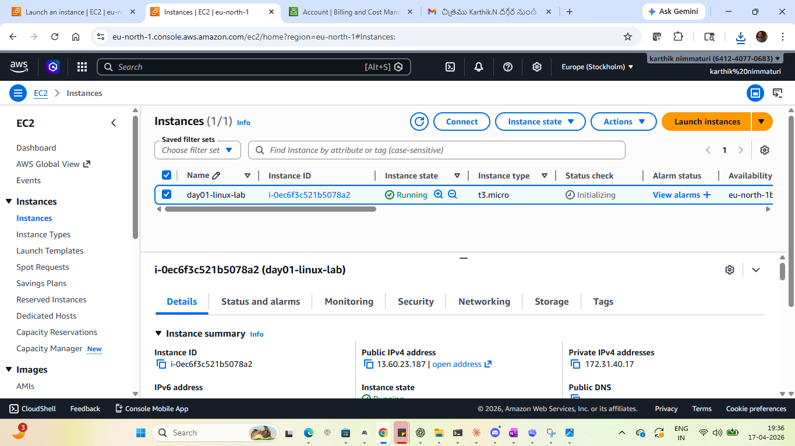
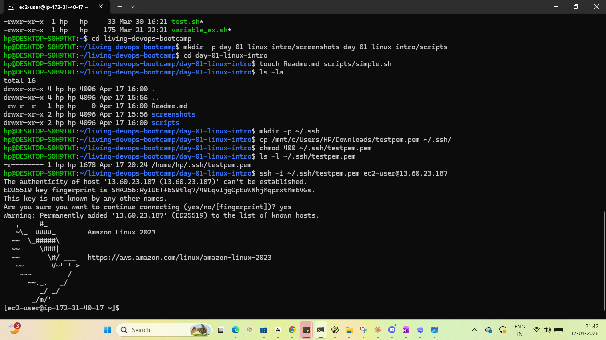
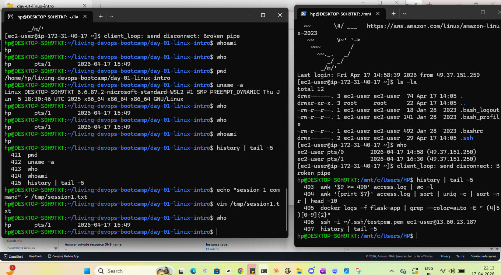
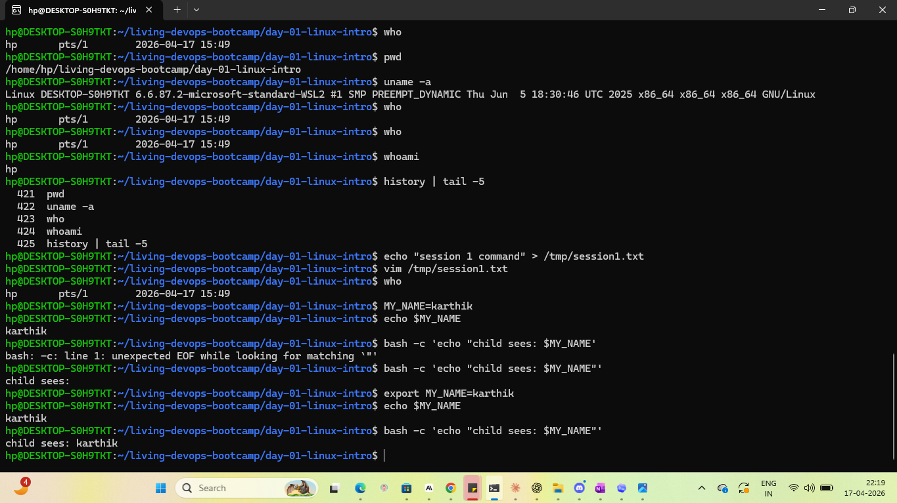
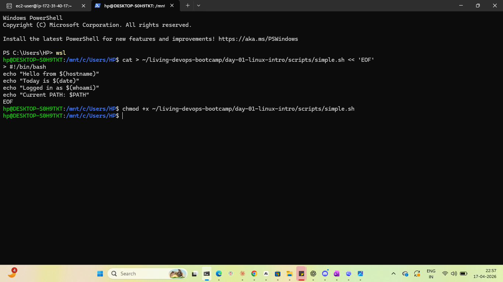

# Day 01 — Linux Intro & First EC2 Lab

Hands-on lab from the **Jan 27, 2026 intro session** of Akhilesh Mishra's Living DevOps AWS Bootcamp. This lab covers the foundational Linux concepts every DevOps engineer is expected to know on day one: SSH access to a cloud VM, session isolation, environment variables, shell config persistence, and PATH troubleshooting.

## Concepts covered

- Launching an EC2 instance in AWS (ap-south-1, Mumbai)
- SSH key pair creation and `chmod 400` permission hardening
- Connecting from WSL Ubuntu to a remote Linux server
- Multi-session behaviour and `history` isolation
- Local shell variables vs exported environment variables
- Persisting configuration via `~/.bashrc`
- User-level vs system-wide config (`~/.bashrc` vs `/etc/profile`)
- `PATH` troubleshooting — breaking and restoring command resolution
- Writing and executing a basic shell script

## Environment

| Component | Detail |
|---|---|
| Cloud | AWS (Free Tier) |
| Region | ap-south-1 (Mumbai) |
| AMI | Amazon Linux 2023 |
| Instance type | t2.micro |
| Local shell | WSL Ubuntu on Windows 11 |
| Editor | VS Code |

## Lab walkthrough

### 1. Launching the EC2 instance

Launched a `t2.micro` Amazon Linux 2023 instance in `ap-south-1` with a new key pair (`day01-key.pem`). Security group was configured to allow SSH (port 22) from **My IP only** — never `0.0.0.0/0` for a real workload.



### 2. Connecting via SSH from WSL

Moved the downloaded `.pem` file into `~/.ssh/` and tightened permissions:

```bash
chmod 400 ~/.ssh/day01-key.pem
ssh -i ~/.ssh/day01-key.pem ec2-user@<public-ip>
```

The `chmod 400` step is mandatory — SSH refuses to use a key that is world-readable. This is the first thing that trips beginners up.



### 3. Session isolation and `history`

Opened two SSH sessions to the same instance simultaneously. Key observations:

- `who` shows all logged-in sessions (two `ec2-user` entries on different pts/).
- Each shell has its own in-memory history; `~/.bash_history` is only written to on logout.
- Commands run in one session are not visible to the other until both exit cleanly.



### 4. Local vs environment variables

```bash
MY_NAME=karthik                     # local — not inherited by child processes
bash -c 'echo $MY_NAME'             # prints empty

export MY_NAME=karthik              # exported — becomes part of environment
bash -c 'echo $MY_NAME'             # prints "karthik"
```

**Takeaway:** a variable defined without `export` lives and dies in the current shell. `export` promotes it to an environment variable that child processes inherit.



### 5. Persisting variables via `~/.bashrc`

Appended `export BOOTCAMP="Living DevOps Jan 2026"` to `~/.bashrc`, ran `source ~/.bashrc`, then logged out and back in to confirm the variable survives a fresh session.

**Interview callout**

| File | Scope | When it runs |
|---|---|---|
| `~/.bashrc` | Current user only | Every new interactive non-login shell |
| `~/.bash_profile` | Current user only | Login shells |
| `/etc/profile` | All users on the system | Login shells, system-wide |
| `/etc/profile.d/*.sh` | All users | Sourced by `/etc/profile` |


### 6. PATH troubleshooting

Simulated a broken `PATH` and recovered from it — a real-world support scenario.

```bash
echo $PATH                          # inspect current PATH
which ls                            # /usr/bin/ls

export PATH=/home/ec2-user          # deliberately break it
ls                                  # bash: ls: command not found

/usr/bin/ls                         # absolute path still works — binary is fine

export PATH=$PATH:/usr/bin:/bin:/usr/local/bin
ls                                  # fixed
```

**Takeaway:** "command not found" does not mean the binary is missing. In 90% of cases it means the shell can't find it in `$PATH`. Always verify with `which <cmd>` and try the absolute path before assuming something is uninstalled.


### 7. First shell script

A trivial script to confirm execution permissions and basic variable expansion. Full source in [`scripts/simple.sh`](scripts/simple.sh).

```bash
chmod +x simple.sh
./simple.sh
```



## Cleanup

After the lab, terminated the EC2 instance and deleted the key pair from AWS to avoid any free-tier drift. The local `.pem` file was kept only for reference and is excluded from git via `.gitignore`.

