# Day 02 — Linux System Performance & Process Management

Hands-on lab from the **Jan 28, 2026 session** of Akhilesh Mishra's Living DevOps AWS Bootcamp. Covers process management, CPU/memory/I/O monitoring, and real-world troubleshooting scenarios on a live EC2 instance.

## Concepts covered

- Process fundamentals — PID, PPID, states (R, S, D, Z, T), hierarchy
- Real-time monitoring with `top` and `htop`
- Process snapshot with `ps aux` and sort options
- Process tree visualization with `pstree`
- CPU load generation with `stress-ng`
- Load average interpretation (1min / 5min / 15min)
- Memory monitoring — `free -h`, `pmap`, understanding `available` vs `free`
- I/O monitoring — `iostat` basic and extended, `iotop`, `%iowait`
- Disk usage — `df -h`, `df -i`, `du -sh`
- Service management with `systemctl`
- Priority adjustment with `renice`
- Real-world troubleshooting: high CPU, memory leak, I/O wait

## Environment

| Component | Detail |
|---|---|
| Cloud | AWS (Free Tier) |
| Region | ap-south-1 (Mumbai) |
| AMI | Amazon Linux 2023 |
| Instance type | t3.micro (2 vCPU, 1 GiB RAM) |
| Local shell | WSL Ubuntu on Windows 11 |

Stress-test parameters were tuned down from the original guide to fit the 1 GiB memory constraint of `t3.micro`.

## Lab walkthrough

### Part 1 — Processes

Explored process fundamentals: every running program has a PID, a parent (PPID), an owner, and a state. PID 1 on Amazon Linux is `systemd`, the ancestor of every user-space process.

**Key commands practiced:**

```bash
ps aux                           # Snapshot of all processes
ps -o pid,ppid,user,cmd -p $$    # Inspect current shell
pstree -p                        # Visual tree of parent-child relationships
sleep 600 &                      # Background process
kill <PID>                       # Graceful termination
```

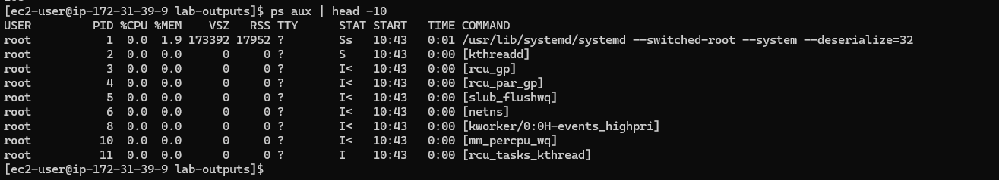
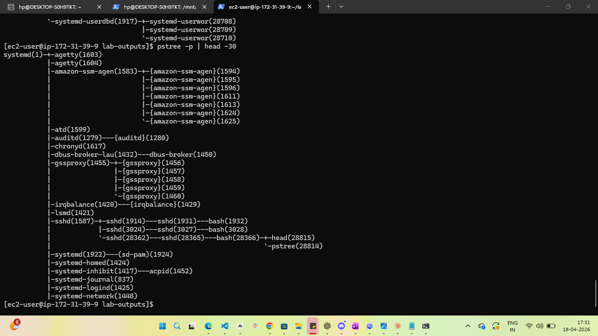

### Part 2 — CPU monitoring

Used `top` and `htop` for real-time CPU monitoring, then generated artificial load with `stress-ng` to observe how the system responds.

```bash
stress-ng --cpu 1 --timeout 30s    # 1 core at 100% for 30s
```

During the stress run, `htop` clearly showed one of the two CPU cores pegged at 100%, the load average climbing, and the `stress-ng-cpu` process at the top of the process list.

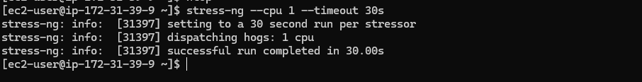

**Load average takeaway:** on a 2-core machine, load of `1.0` means half the total CPU capacity is in use. Anything above `2.0` means tasks are queueing.

### Part 3 — Memory monitoring

Distinguished `free` (truly unused RAM) from `available` (RAM the kernel can reclaim from caches if needed). The **available** column is what matters for capacity planning.

```bash
free -h
stress-ng --vm 1 --vm-bytes 200M --timeout 30s
watch -n 1 free -h   # observe change in real time
```

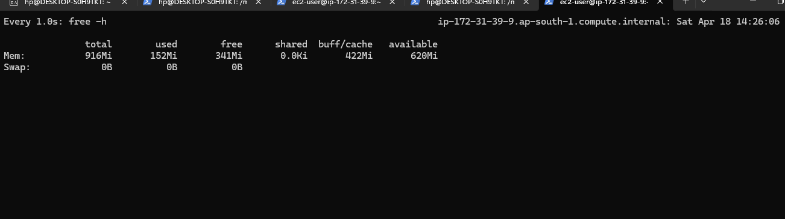

### Part 4 — I/O monitoring

`iostat` for overall disk statistics, `iotop` for per-process I/O. Used `dd` to generate a 500 MB write and observe `%util` and `%iowait` spike.

```bash
iostat -x 2        # Extended stats, update every 2s
sudo iotop -o      # Only processes currently doing I/O
dd if=/dev/zero of=/tmp/bigfile bs=1M count=500
```

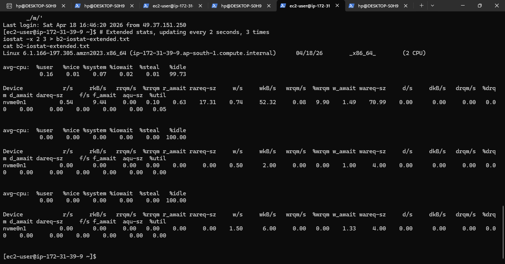
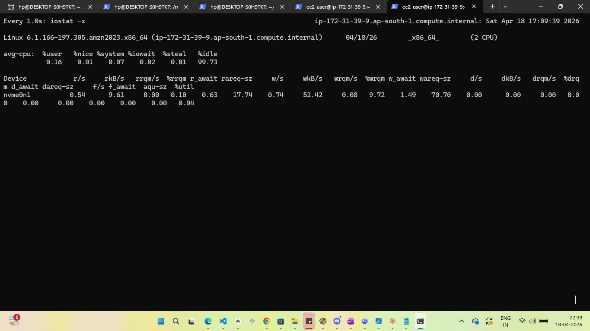

**Key threshold:** `%iowait > 30%` indicates the disk is a bottleneck — CPU is idle only because it's waiting on slow storage.

### Part 5 — Service management

```bash
sudo systemctl status sshd
sudo systemctl is-enabled sshd   # will it start at boot?
sudo systemctl is-active sshd    # is it running now?
```

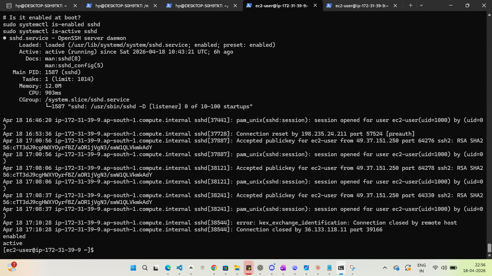

**Interview callout:** `is-enabled` and `is-active` are independent. A service can be enabled but not running (failed to start), or running but not enabled (won't survive a reboot).

### Part 6 — System monitor script

Wrote a reusable bash script that produces a one-page system health report. Full source in [`scripts/system-monitor.sh`](scripts/system-monitor.sh).

```bash
./system-monitor.sh
```

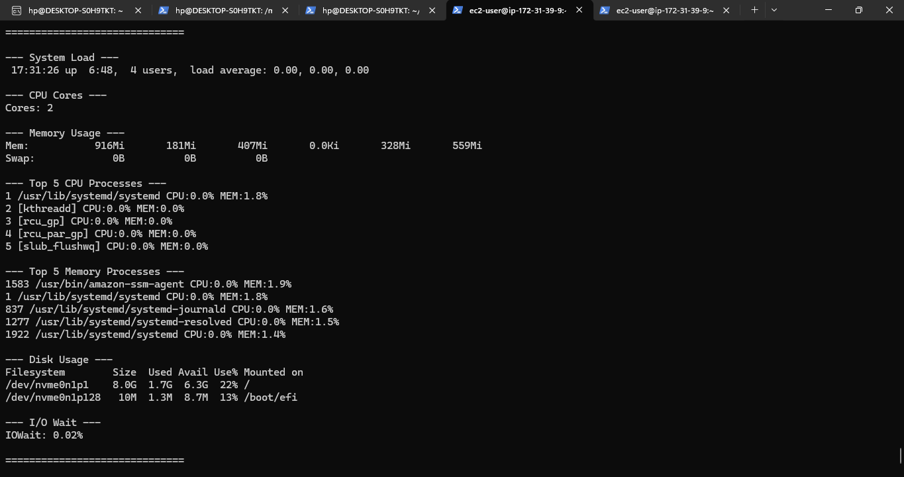

### Part 7 — Real-world scenarios

**Scenario 1 — High CPU:** simulated a runaway process, then walked through the investigation: `uptime` → `ps aux --sort=-%cpu` → process details → remediation via `kill` or `renice`.

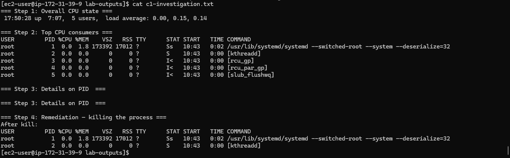

**Scenario 2 — Memory pressure:** used `stress-ng --vm` to push memory, investigated with `free -h`, `ps aux --sort=-%mem`, and `pmap` for per-process memory mapping.

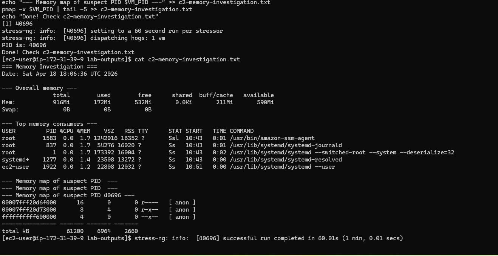

**Resource hog finder script** ([`scripts/find-hogs.sh`](scripts/find-hogs.sh)) scans for top CPU hogs, memory hogs, processes stuck in D state (uninterruptible I/O wait), zombie processes, and deprioritised processes.

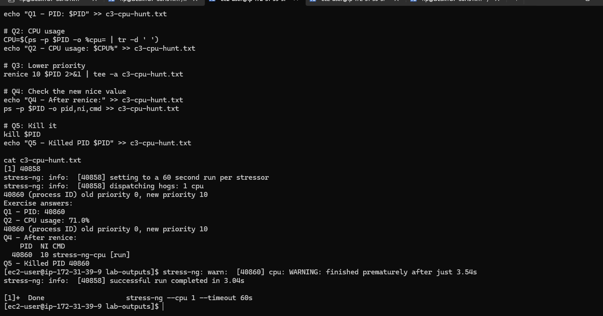

## Practice exercise: CPU hunt

Full answer set in [`outputs/c3-cpu-hunt.txt`](outputs/c3-cpu-hunt.txt).

1. Start load: `stress-ng --cpu 1 --timeout 60s &`
2. Find PID: `pgrep stress-ng-cpu`
3. Check CPU usage: `ps -p <PID> -o %cpu`
4. Lower priority: `renice 10 <PID>`
5. Kill: `kill <PID>`

## Key interview questions this lab prepares you for

1. What does load average of `3.5` mean on a 2-core system?
2. Difference between `free` and `available` in `free -h` output — why is one nearly always higher?
3. A process is stuck in `D` state — what does that mean and what can you do about it?
4. A `kill <PID>` isn't working. Why, and what do you do next?
5. `top` shows 99% idle but the system feels slow — where do you look next?
6. What's the difference between `systemctl is-enabled` and `is-active`?
7. Explain what `%iowait` actually measures.
8. What's a zombie process, and why does it happen?

## Cleanup

- Terminated EC2 instance `day02-perf-lab` immediately after the lab.
- Removed `/tmp/bigfile` and killed all `stress-ng` processes before terminating.
- Kept `day01-key.pem` locally (excluded from git via `.gitignore`).

## Next up

Day 03 — foundation topics before next week's AWS deep-dive.

---

*Part of the [living-devops-bootcamp](../) series.*