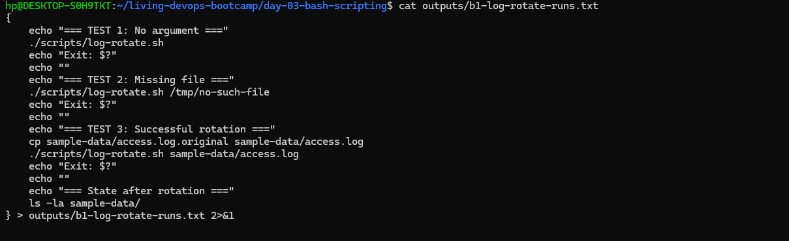
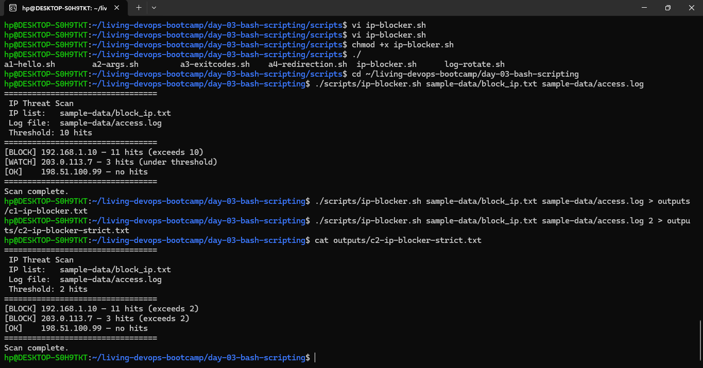
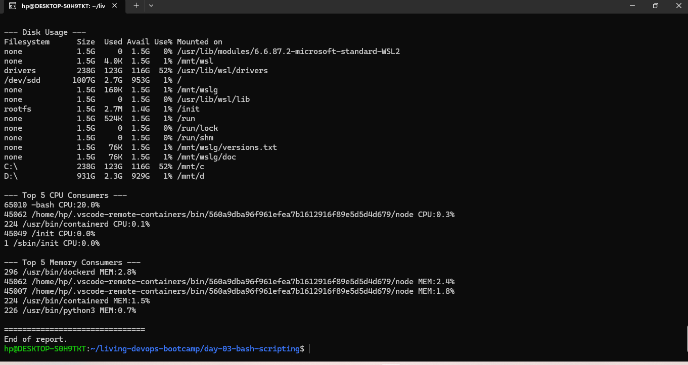
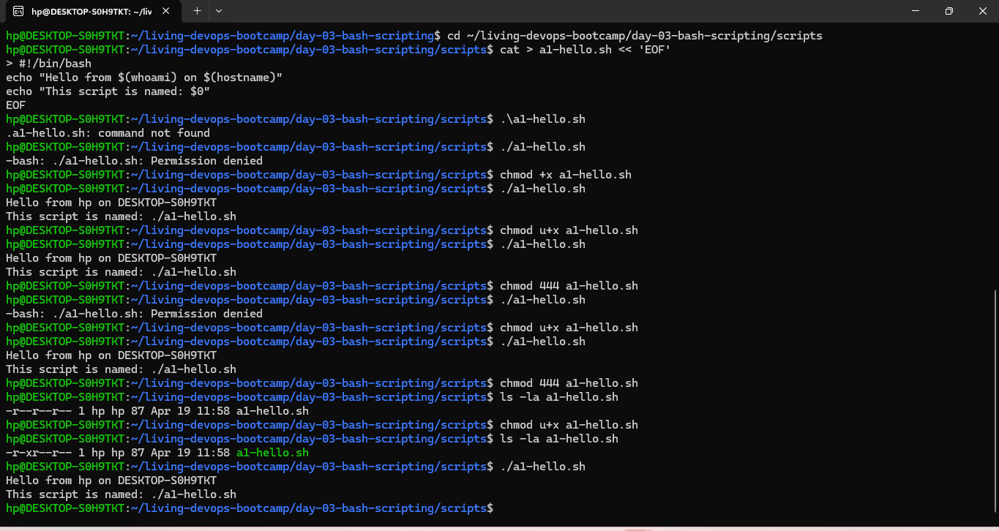

# Day 03 — Bash Scripting Fundamentals & Three Real-World Scripts

Hands-on lab from the **Jan 29, 2026 session** of Akhilesh Mishra's Living DevOps AWS Bootcamp. Covers bash scripting fundamentals (arguments, exit codes, redirection, conditionals, loops, functions) and applies them to three real-world scripts a DevOps engineer might write on their first week on the job.

## Concepts covered

- Shebang line and shell selection (`#!/bin/bash` vs `/bin/sh`)
- File permissions (`chmod`, the read/write/execute bits)
- Command-line arguments — `$0`, `$1`, `$#`, `$@`
- Exit codes — `$?`, `exit 1`, the meaning of zero vs non-zero
- I/O redirection — `>`, `>>`, `2>`, `&>`, `/dev/null`
- Conditional statements — `if [ -f $file ]`, `-z`, `-gt`, `-eq`
- For loops — iterating over file contents
- While loops — runtime conditionals
- Functions — code organization and reuse
- AWK — extracting fields, calculating percentages

## Environment

| Component | Detail |
|---|---|
| OS | Ubuntu (WSL on Windows 11) |
| Shell | Bash 5.x |
| No cloud resources used | Pure local scripting |

## The three scripts

### 1. Log rotation — [`scripts/log-rotate.sh`](scripts/log-rotate.sh)

Compresses a log file with a timestamp suffix, then truncates the original so the application can keep writing without losing its file handle. Used in production whenever an application generates large logs that fill up disk.

```bash
./log-rotate.sh sample-data/access.log
# → access.log.20260129-103045.gz
```

**Concepts demonstrated:** argument validation, file-existence check (`-f`), exit codes for different failure modes (1 = bad args, 2 = file missing, 3 = compression error), variable interpolation, `$(date)` for timestamps.



### 2. Suspicious IP blocker — [`scripts/ip-blocker.sh`](scripts/ip-blocker.sh)

Reads a list of IPs from `block_ip.txt`, counts how many times each appears in an access log, and flags any exceeding a configurable threshold. Real version of this is what fail2ban does under the hood.

```bash
./ip-blocker.sh sample-data/block_ip.txt sample-data/access.log 10
# [BLOCK] 192.168.1.10 — 11 hits (exceeds 10)
# [WATCH] 203.0.113.7 — 3 hits (under threshold)
# [OK]    198.51.100.99 — no hits
```

**Concepts demonstrated:** for loop over file contents, `grep -c` for counting, comparison with `-gt`, default parameter values (`${3:-10}`), three-way conditional logic.



### 3. System monitor with functions — [`scripts/sys-monitor.sh`](scripts/sys-monitor.sh)

Generates a system health report. Uses bash functions to keep each section (CPU, memory, disk, processes) isolated and testable. Output can go to stdout or a named file.

```bash
./sys-monitor.sh report.txt
```

**Concepts demonstrated:** function definitions, `main()` pattern, default parameter values, AWK for percentage calculations, output redirection at function boundaries.



## Scripting fundamentals (Phase A)

Before the three deliverables, four short exercises lock in the basics. Outputs are in [`outputs/`](outputs/).

| Concept | Script | Output |
|---|---|---|
| Permissions & shebang | `a1-hello.sh` | n/a — see screenshot |
| Args (`$0`, `$1`, `$#`, `$@`) | `a2-args.sh` | `outputs/a2-args.txt` |
| Exit codes | `a3-exitcodes.sh` | `outputs/a3-exitcodes.txt` |
| I/O redirection | `a4-redirection.sh` | `outputs/a4-stdout.txt`, `outputs/a4-errors.txt` |



## Key interview questions this lab prepares you for

1. What does `#!/bin/bash` actually do?
2. Difference between `$*` and `$@` when arguments contain spaces.
3. What's the meaning of exit code `0` vs non-zero? Name one non-zero code you've used.
4. Difference between `>`, `>>`, `2>`, and `&>`.
5. Why use `> /dev/null 2>&1` in cron jobs?
6. How do you check if a file exists before processing it?
7. When would you use a `for` loop vs a `while` loop?
8. What's the value of organizing a script with functions instead of one long block?

## Sample data

`sample-data/access.log` is a hand-crafted nginx-style log with a brute-force pattern: 11 failed POSTs to `/api/login` from `192.168.1.10`. This makes the IP blocker's threshold logic easy to verify visually.

`sample-data/block_ip.txt` is a small watchlist with one obviously-malicious IP, one borderline IP, and one absent IP — covers all three branches of the script's conditional.

## Next up

Day 04 onward — AWS deep dive starts. VPC, EC2, IAM with proper Terraform.

---

*Part of the [living-devops-bootcamp](../) series.*