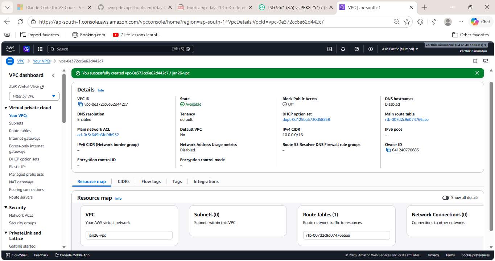
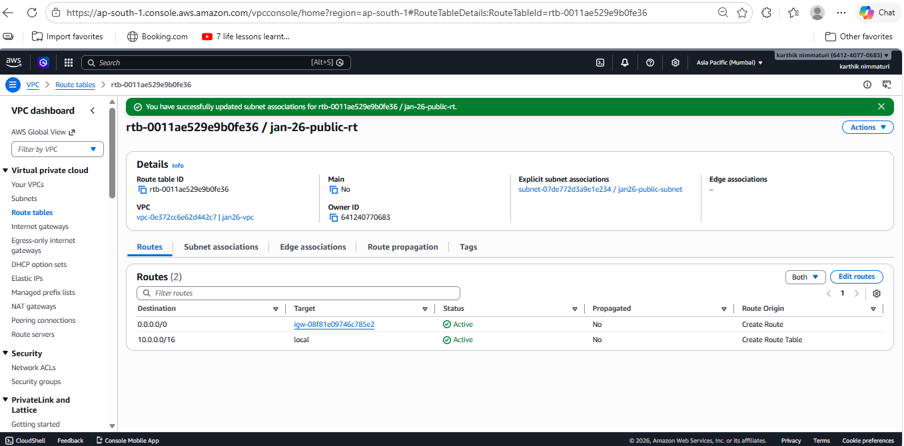
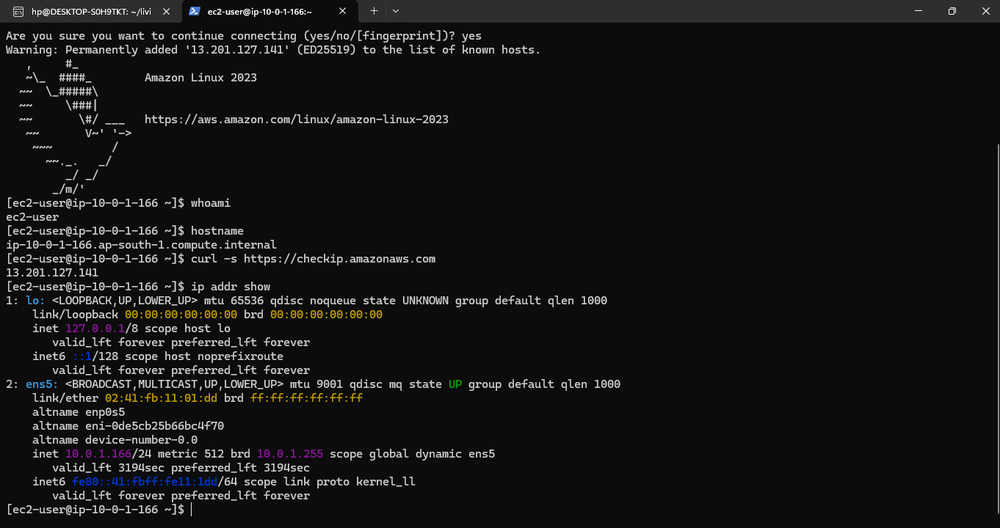
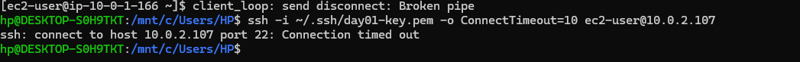
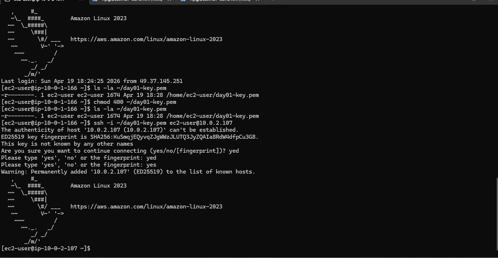
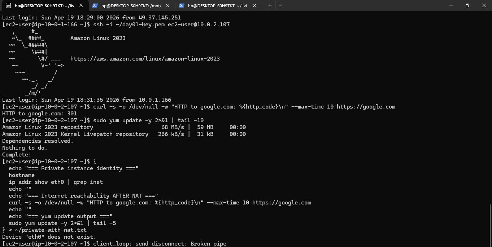

# Day 04 — AWS Networking: Custom VPC, Bastion Host, NAT Gateway

Hands-on lab from the **Feb 3, 2026 session** of Akhilesh Mishra's Living DevOps AWS Bootcamp. Built a production-style network architecture from scratch in AWS: custom VPC, public and private subnets across one AZ, Internet Gateway for public access, NAT Gateway for private outbound internet, and a bastion host pattern for securely reaching private instances.

## Architecture

See [diagrams/architecture.md](diagrams/architecture.md) for the full diagram and traffic flow table.

At a glance:
- **VPC** (`10.0.0.0/16`) with one public and one private subnet
- **Bastion EC2** in the public subnet — SSH entry point
- **Private EC2** in the private subnet — no public IP, reached only via bastion
- **NAT Gateway** gives the private EC2 outbound internet access (for `yum update`, etc.) without exposing it to inbound traffic
- **Security groups** enforce: SSH to bastion only from my IP; SSH to private EC2 only from the bastion's SG

## Concepts covered

- VPC as AWS's virtual private network equivalent
- CIDR blocks and subnet sizing (`/16` for VPC, `/24` for subnets)
- Gateway IP and broadcast IP — why usable hosts = 2^n − 2
- Subnets as zonal resources; VPCs as regional resources
- Internet Gateway (IGW) — one-to-one with VPC
- Route tables — what actually makes a subnet "public" or "private"
- Auto-assign public IPv4 setting on a subnet
- Security groups vs route tables — two independent layers
- Bastion host / jump box pattern
- SCP for moving files between machines
- NAT Gateway vs NAT Instance — why NAT GW is the production choice
- Elastic IP — static public IP, billed only when detached
- The teardown order required to avoid orphaned billable resources

## Environment

| Component | Detail |
|---|---|
| Cloud | AWS (Free Tier + NAT cost) |
| Region | ap-south-1 (Mumbai) |
| AZ | ap-south-1a |
| Compute | 2 × t3.micro (Amazon Linux 2023) |
| Total lab cost | ~₹15 (NAT Gateway for the live portion) |

## Build walkthrough

### Phase A — VPC, subnets, IGW, public route table

Created the VPC shell and the public side of the network.

| Resource | Detail |
|---|---|
| VPC | `jan26-vpc` — 10.0.0.0/16 (65,536 IPs) |
| Public subnet | `jan26-public-subnet` — 10.0.1.0/24 |
| Private subnet | `jan26-private-subnet` — 10.0.2.0/24 |
| IGW | `jan26-igw` — attached to VPC |
| Public route table | `jan26-public-rt` — `0.0.0.0/0 → igw`, associated with public subnet |

Enabled auto-assign public IPv4 on the public subnet so EC2s launched there get a public IP automatically.

**Key insight:** a subnet is only "public" because its route table sends 0.0.0.0/0 to an IGW. There is no checkbox on the subnet that labels it public. The route table association does.

### Phase B — Bastion EC2 + security group + SSH

Launched a public EC2 (`jan26-bastion`) as the SSH entry point to the VPC.

- Security group `jan26-bastion-sg` — SSH (22) from My IP only
- Placed in `jan26-public-subnet` so it inherits auto-assigned public IP
- SSH'd in from WSL using `day01-key.pem` (reused from Day 01)
- Verified full outbound internet from bastion (curl google.com → 301, `yum update` succeeded)

Proof of outbound reachability captured in [`outputs/bastion-proof.txt`](outputs/bastion-proof.txt).

### Phase C — Private EC2 + bastion SSH pattern

Launched `jan26-private` in the private subnet with **no public IP**.

- Security group `jan26-private-sg` — SSH (22) accepts only from source SG `jan26-bastion-sg`
- Direct SSH from laptop to private EC2 fails (expected — no public IP, no route)
- SCP'd `day01-key.pem` onto the bastion
- Two-hop SSH: laptop → bastion → private EC2 worked

At this stage, the private EC2 also has no outbound internet — `yum update` hangs. Evidence in [`outputs/private-no-nat.txt`](outputs/private-no-nat.txt).

**Security note:** copying a private key to a server is done here for learning. In production, use `ssh -A` (agent forwarding) or SSM Session Manager so the key never leaves your laptop.

### Phase D — NAT Gateway for private outbound

Gave the private subnet outbound-only internet access.

| Resource | Detail |
|---|---|
| Elastic IP | Allocated from ap-south-1 pool |
| NAT Gateway | `jan26-nat` — in `jan26-public-subnet`, associated with the EIP |
| Private route table | `jan26-private-rt` — `0.0.0.0/0 → nat`, associated with private subnet |

After the NAT reached Available state:
- `curl google.com` from private EC2 → 301 ✅
- `sudo yum update -y` → completed successfully ✅
- Direct SSH from laptop to private EC2 → still times out ✅ (proves outbound-only)

Before/after evidence in [`outputs/private-with-nat.txt`](outputs/private-with-nat.txt) vs [`outputs/private-no-nat.txt`](outputs/private-no-nat.txt).

**Why NAT GW and not NAT Instance:** NAT Gateway auto-scales and is fully managed. NAT Instance is a self-managed EC2 — single point of failure, manual scaling. Production uses NAT GW. The cost is the tradeoff (~₹4/hour vs t3.nano EC2 cost).

**Why `VPC Gateway Endpoint` is worth knowing:** the only free alternative to NAT GW — but only works for traffic to S3 and DynamoDB. Not a general-purpose replacement.

## Cleanup

Cleaning up AWS networking resources requires a specific order because of dependencies: