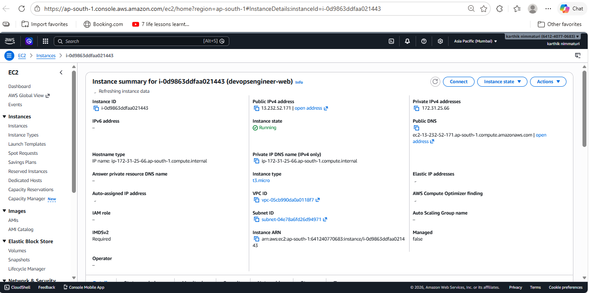
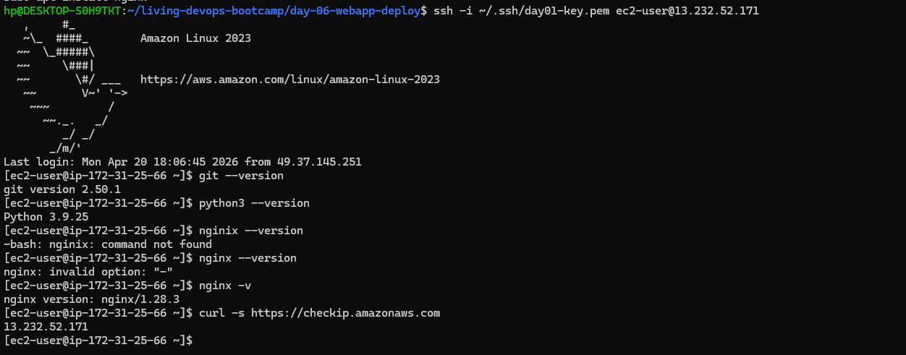
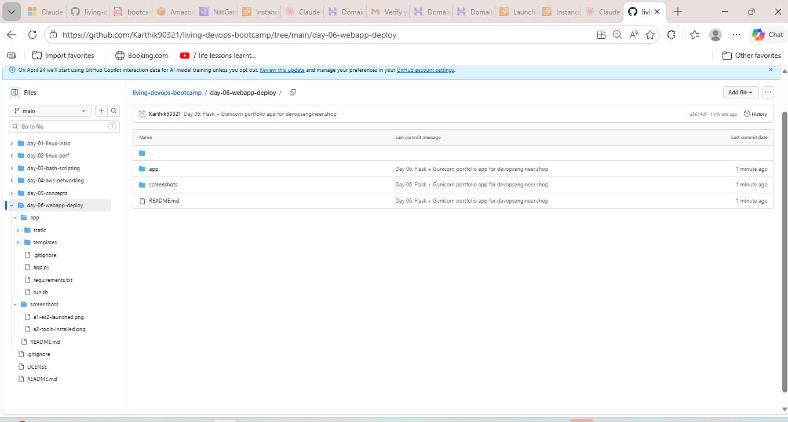
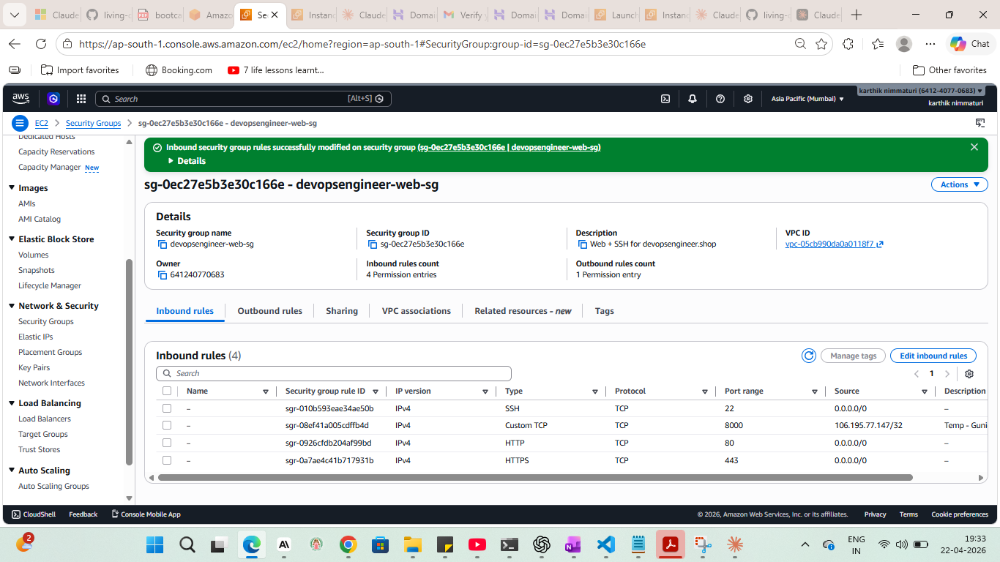
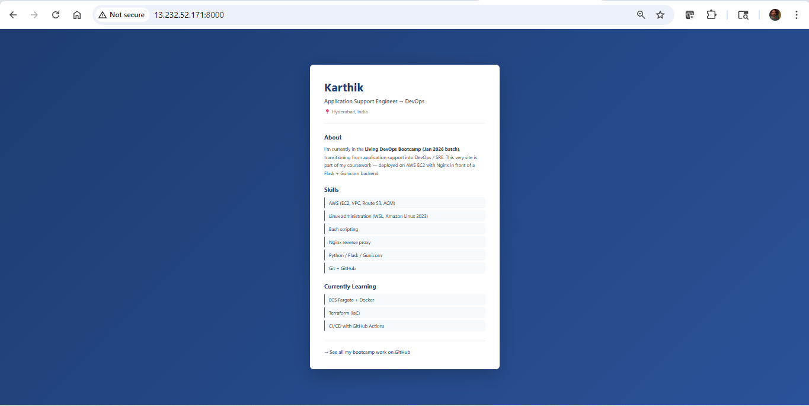
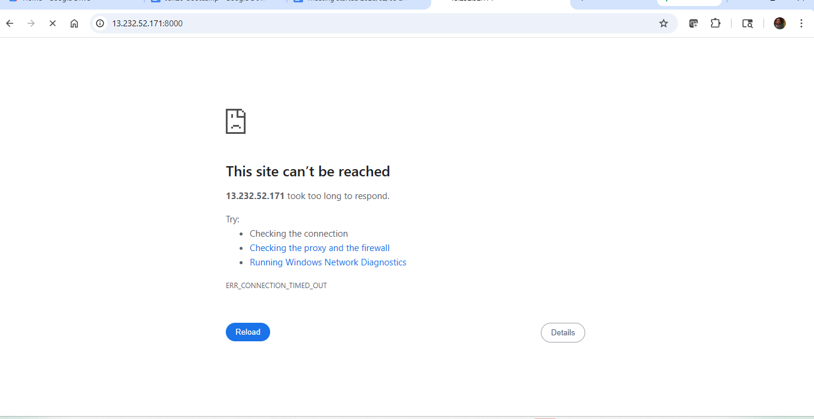
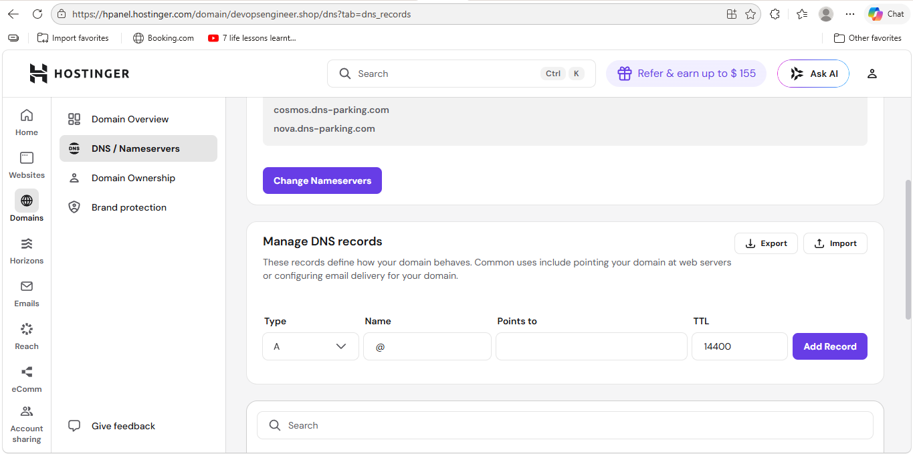
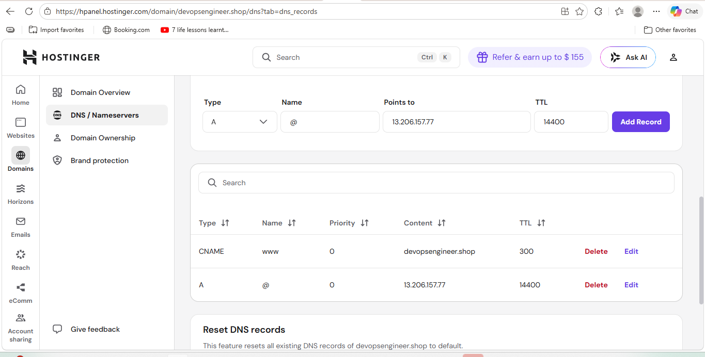
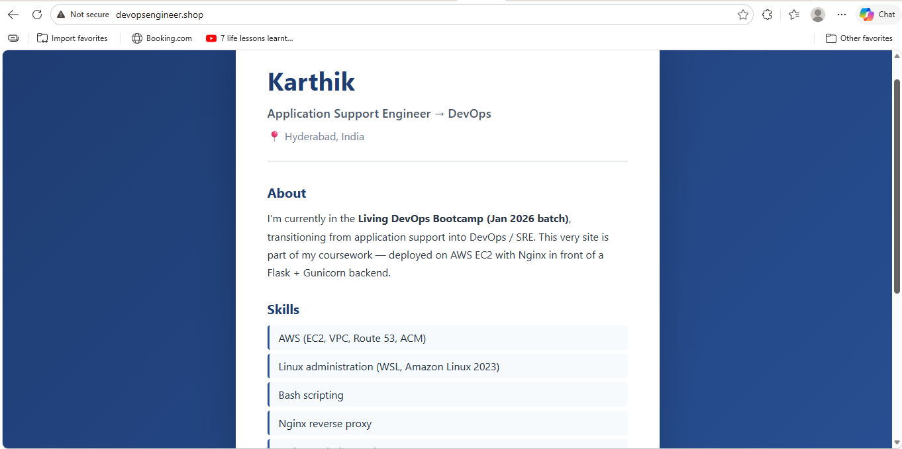

# Day 06 — Web App Deployment: Flask + Gunicorn + Nginx + Custom Domain

Hands-on lab from the **Feb 5, 2026 session** of Akhilesh Mishra's Living DevOps AWS Bootcamp. Took the concepts from Day 05 (Flask, Gunicorn, Nginx, DNS) and actually built it — a personal portfolio app running live on a custom domain.

## Concepts covered

- EC2 setup for a Python web app — git, python3, pip, nginx
- Python `venv` and `requirements.txt` — why you isolate dependencies per project
- Flask as the app framework, Gunicorn as the production WSGI server
- Why you don't run the Flask dev server in production and don't expose Gunicorn directly to the internet
- Nginx as a reverse proxy — handles port 80, forwards to Gunicorn on 8000
- Temporarily opening a port to test, then locking it down once the proxy is confirmed working
- Deploying code via GitHub — push locally, pull on server
- DNS A record — pointing a domain to an EC2 public IP
- Difference between HTTP (what we have) and HTTPS (what comes next)

## Environment

| Component | Detail |
|---|---|
| Cloud | AWS (Free Tier) |
| Region | ap-south-1 (Mumbai) |
| AMI | Amazon Linux 2023 |
| Instance type | t2.micro |
| App | Flask 3.0.3 + Gunicorn 23.0.0 (4 workers) |
| Web server | Nginx |
| Domain registrar | Hostinger |
| Domain | devopsengineer.shop |
| Local shell | WSL Ubuntu on Windows 11 |

## The app

A simple Flask portfolio page — two routes:

- `GET /` — portfolio page (name, tagline, skills, currently learning)
- `GET /health` — returns `{"status": "ok"}` for monitoring later

Source: [`app/app.py`](app/app.py). [`app/run.sh`](app/run.sh) handles the full boot sequence — creates venv, installs deps, starts Gunicorn.

## Lab walkthrough

### Phase A — EC2 launch and tools

Launched a `t2.micro` Amazon Linux 2023 in `ap-south-1`. SSH on port 22 from My IP only. Then installed everything needed:

```bash
sudo dnf update -y
sudo dnf install -y git python3 python3-pip nginx
```





### Phase B — Code on the server

Wrote the app locally, pushed to GitHub, pulled on the EC2:

```bash
git clone https://github.com/Karthik90321/living-devops-bootcamp.git
cd living-devops-bootcamp/day-06-webapp-deploy/app
```



### Phase C — Verify the app runs on port 8000

Before adding Nginx, first confirmed the app itself works. Temporarily opened port 8000 in the security group (inbound, TCP, My IP) and ran:

```bash
bash run.sh
```

`http://<EC2-public-IP>:8000` loaded the portfolio page. `/health` returned `{"status": "ok"}`. Then moved on to Nginx.

**Why test on 8000 first:** if something breaks after adding Nginx, you know it's a Nginx config problem and not the app. Saves time.




### Phase D — Nginx reverse proxy

Created `/etc/nginx/conf.d/app.conf`:

```nginx
server {
    listen 80;
    server_name _;

    location / {
        proxy_pass http://127.0.0.1:8000;
        proxy_set_header Host $host;
        proxy_set_header X-Real-IP $remote_addr;
    }
}
```

```bash
sudo nginx -t
sudo systemctl enable nginx
sudo systemctl restart nginx
```

`http://<EC2-public-IP>` (port 80, no port in URL) loaded the page ✅. Removed the port 8000 inbound rule from the security group — Gunicorn is now only reachable from Nginx on localhost ✅.

**Key insight:** a route table makes a subnet public or private; a security group is the second, separate layer. Same idea here — Nginx is the only public entry point. Gunicorn is internal. The security group enforces that at the network level.





### Phase E — Custom domain via Hostinger DNS

Added an A record in Hostinger pointing `devopsengineer.shop` at the EC2 public IP:

| Type | Name | Value |
|---|---|---|
| A | @ | `<EC2-public-IP>` |

DNS propagated in a few minutes. `http://devopsengineer.shop` loaded the portfolio page live ✅.

**Worth noting:** the EC2 public IP changes every stop/start. For anything permanent, attach an Elastic IP first so the A record doesn't go stale.







## What's missing

The site is on HTTP, not HTTPS. Anyone on the same network can read the traffic. Next step is `certbot --nginx` to get a free Let's Encrypt cert and flip it to HTTPS.

Also Gunicorn is running in the foreground from `run.sh` — it dies if the SSH session closes or the server reboots. Should be a `systemd` service.

---

*Part of the [living-devops-bootcamp](../) series.*
